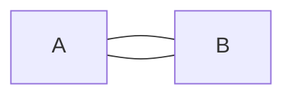
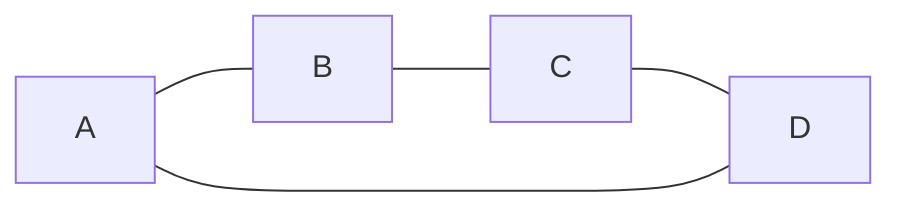
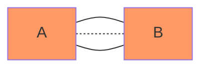
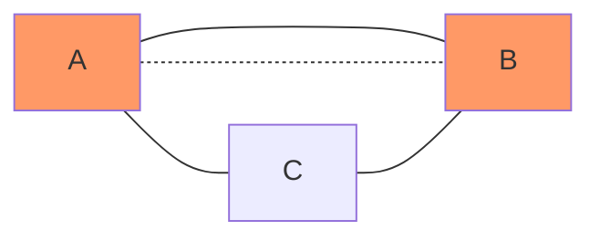
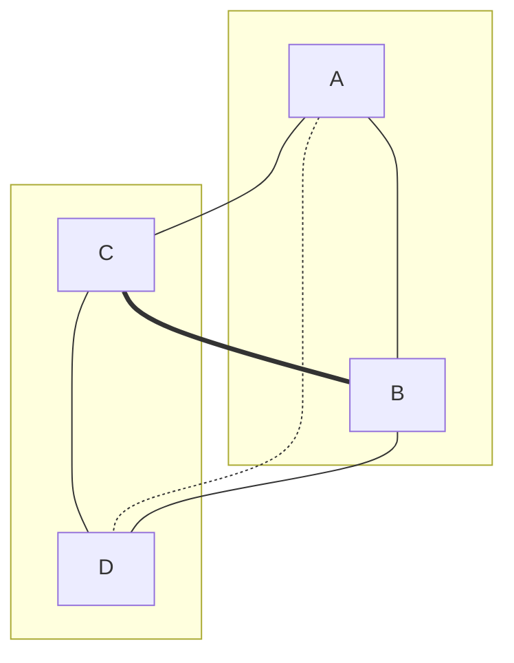

# 코딩 테스트 결과

## Vanilla JS

### 구조 분해 할당

배열의 값 또는 객체의

```ts
const [a, b] = [1, 2, 3, 4, 5]
// a = 1, b = 2

const [a, b, ...rest] = [1, 2, 3, 4, 5]
// a = 1, b = 2, rest = [3, 4, 5]

const [a, b, ...rest] = [1]
// a = 1, b = undefined, rest = []

const [a, b, ...rest] = []
// a = undefined, b = undefined, rest = []
```

```ts
const { a, b } = { a: 1, b: 2, c: 3, d: 4, e: 5 }
// a = 1, b = 2

const { a, b, ...rest } = { a: 1, b: 2, c: 3, d: 4, e: 5 }
// a = 1, b = 2, rest = { c: 3, d: 4, e: 5 }

const { a, b } = {}
// a = undefined, b = undefined
```

[참고 링크](https://developer.mozilla.org/en-US/docs/Web/JavaScript/Reference/Operators/Destructuring_assignment)

### 배열

```ts
const arr = [] // undefined
arr.push("a") // 1, ["a"]
arr.shift() // "a", arr = []
arr.unshift("a") // 1, ["a"]
```

## 알고리즘

그래프의 임의 노드로부터 시작해 모든 간선을 한 번만 지나는 경로를 찾는 것은 한붓그리기 문제이다. 한붓그리기가 가능하려면 모든 노드를 통틀어 홀수 개의 간선을 가진 노드(홀수점)가 0개 또는 2개여야 한다.

<details><summary>원리</summary>

### 홀수점이 0개인 그래프





모든 노드의 차수가 짝수인 짝수점이므로, 어느 노드에서 시작해도 한붓그리기가 가능하다.

### 홀수점이 2개인 그래프





짝수점만 있는 그래프에서 한붓그리기를 마친 후, 도착점에서 노드 하나를 택해 간선을 그은 것으로 볼 수 있다. 만약 이 두 노드가 아닌 다른 점에서 한붓그리기를 시작한다면, 기존 그래프에서 한붓그리기를 마친 후 해당 노드로 갈 방법이 없어 한붓그리기가 불가능해진다.

### 홀수개 간선이 2(n + 1)개인 그래프



홀수점이 2개인 그래프에서 한붓그리기를 마친 후, 도착지에 연결되지 않은 두 짝수점을 골라 새로운 간선을 그은 것으로 볼 수 있다. 이때 새롭게 선택한 간선으로 갈 방법이 없으므로, 한붓그리기가 불가능하다.

</details>
