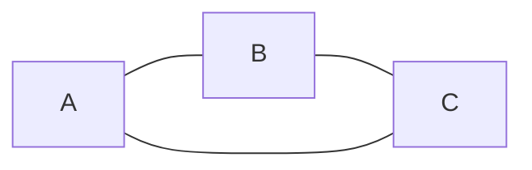
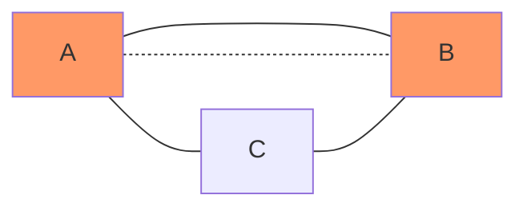
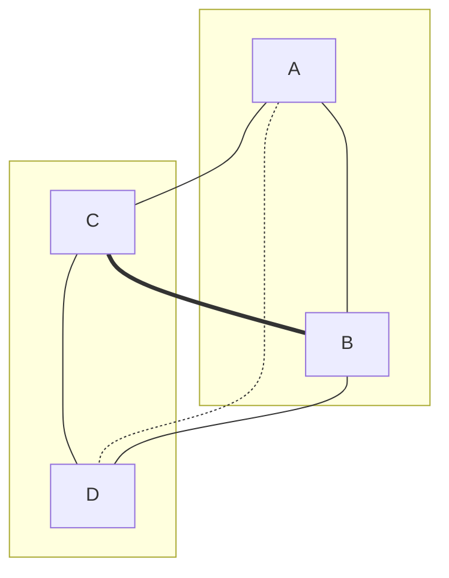

# 코딩 테스트 풀이

폴리큐브의 코딩 테스트 문제 풀이입니다. 항목별 풀이는 링크를 클릭해주세요.

## [Vanilla JS](./js.ipynb)

## [Web](./web/README.md)

## 알고리즘

그래프의 임의 노드로부터 시작해 모든 간선을 한 번만 지나는 경로를 찾는 것은 [한붓그리기 문제 (Eulerian Path)](https://en.wikipedia.org/wiki/Eulerian_path)이다.

### 구현

### 경로가 존재하기 위한 조건

한붓그리기가 가능하려면 모든 노드를 통틀어 홀수 개의 간선을 가진 노드(홀수점)가 0개 또는 2개여야 한다.

원리

### 홀수점이 0개인 그래프

모든 노드의 차수가 짝수인 짝수점이므로, 어느 노드에서 시작해도 한붓그리기가 가능하다.

### 홀수점이 2개인 그래프

짝수점만 있는 그래프에서 한붓그리기를 마친 후, 도착점에서 노드 하나를 택해 간선을 그은 것으로 볼 수 있다. 만약 이 두 노드가 아닌 다른 점에서 한붓그리기를 시작한다면, 기존 그래프에서 한붓그리기를 마친 후 해당 노드로 갈 방법이 없어 한붓그리기가 불가능해진다.

### 홀수개 간선이 2(n + 1)개인 그래프

홀수점이 2개인 그래프에서 한붓그리기를 마친 후, 도착지에 연결되지 않은 두 짝수점을 골라 새로운 간선을 그은 것으로 볼 수 있다. 이때 새롭게 선택한 간선으로 갈 방법이 없으므로, 한붓그리기가 불가능하다.

